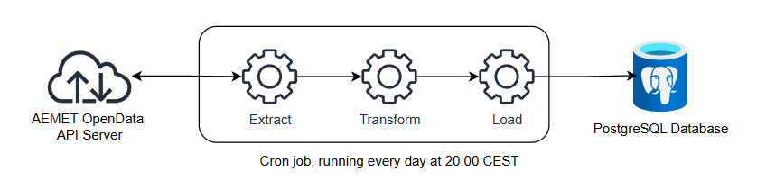
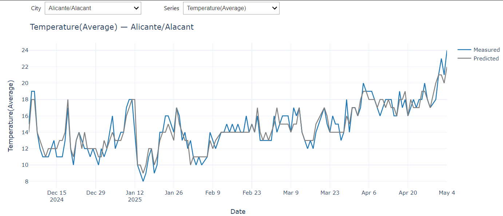

# Weather Data of Southeastern Spain

This project collects and analyzes meteorological data for drought-prone areas in Southeastern Spain (provinces of Almería, Murcia, Alicante, and Valencia). It implements a Python-based ETL pipeline that extracts data from the AEMET OpenData API, transforms and aggregates the weather data, and loads it into a PostgreSQL database. The goal is to enable analysis of desertification risk and extreme weather events (e.g., DANA/"gota fría"). 

## 🌍Overview

The data pipeline is orchestrated by `pipeline.py` and follows an ETL pattern:

1. **extract.py**
   - Fetches raw JSON data from the AEMET API.

2. **transform.py**
   - Cleans and normalizes the raw data into Python dictionaries with correct types (`float`, `int`, `str`).  
   - Computes daily statistics (average, maximum, and minimum) for temperature and relative humidity.

3. **load.py**
   - Executes SQL INSERT/UPDATE statements to store the transformed weather data. 

4. **pipeline.py** _(orchestrator)_
   - Reads the list of target cities.
   - Calls `extract.py`, then `transform.py`, then `load.py` for each city.

**Application Architecture**

The Application Architecture is illustrated below, showing data flow from the AEMET API through the Extract-Transform-Load stages into the PostgreSQL database:



### Data Storage

The PostgreSQL database `southeast_spain_weather` contains two main tables:

- `cities`: stores the data about the cities/towns to be able to make the queries to the API as information for future data analysis.
- `weather_data`: stores the processed weather records (daily measurements and forecasts) for each city.


*Entity-Relationship diagram for the `southeast_spain_weather` database.*

### API Queries
#### **Prediction data**
Hourly forecast for the city passed as a parameter: **postal_code**. Provides hourly information up to 48 hours.

Queries are performed starting from 20:00 to obtain values for the next 24 hours of the following day.

```sh
/api/prediccion/especifica/municipio/horaria/{postal_code}
```

There's another similar query:
```sh
/api/prediccion/especifica/municipio/diaria/{postal_code}
```
But it provides the same response data.

#### **Meteo data**
Returns a summary of weather values taken at a certain weather station on the specified date. In this case we have to put limits in the date so that they are 24 hours and coincide with the data of the prediction query.

```sh
/api/valores/climatologicos/diarios/datos/fechaini/{start_date}/fechafin/{end_date}/estacion/{station_code}
```

It' i's necessary to ask for data from 5-6 days before, since some stations may not have them ready until then.

## Selected Locations
The project focuses on cities and towns in Southeastern Spain that are at high risk of desertification or drought. These areas have had unusually low precipitation and high aridity indices in recent years (see figures below for context):

**Accumulated Precipitation in the Hydrological Year (2024)**


**Spain-Aridity Index**


**Frequency of DANA (gota fría) events**


### Monitored Locations

- **Valencia**: Carcaixent, Llíria, Ontinyent, Sagunto, Utiel, Valencia, Xàtiva
- **Alicante**: Alcoy, Alicante, Benidorm, Elche, Jávea, Novelda, Orihuela, Pego, Rojales, Villena
- **Murcia**: Águilas, Alcantarilla, Archena, Bullas, Calasparra, Caravaca de la Cruz, Cartagena, Cieza, Fuente Álamo, Jumilla, Lorca, Mazarrón, Molina de Segura, Mula, Murcia, Puerto Lumbreras, Torre-Pacheco, Totana, Yecla
- **Almería**: Almería, El Ejido, Garrucha, Huércal-Overa

## 🌐AEMET OpenData API

For details on the available endpoints and data formats, refer to the [AEMET OpenData portal](https://opendata.aemet.es/dist/index.html). An API key is required to access the endpoints (see `Obtain an AEMET API key` below).


## ⚙️Installation and Configuration

1. **Clone the repository** 

```sh
git clone https://github.com/Jesus-Guijarro/weather-spain.git
cd weather-spain
```

2. **Create & activate a virtual environment** 

```sh
python -m venv weather-env

# On Linux/macOS:
source weather-env/bin/activate

# On Windows:
weather-env\Scripts\activate
```

Then install dependencies:
```sh
pip install -r requirements.txt
```

3. **Set up PostgreSQL database**

```sh
psql -U postgres
```
In the psql console, run:
```sql
CREATE DATABASE southeast_spain_weather;
\c southeast_spain_weather
-- Execute the SQL script to create tables:
\i database/southeast_spain_weather_db.sql
```

4. **Configure the database connection**  

Create a file named `config.ini` in the project root with your DB credentials:
```conf
[database]
dbname = southeast_spain_weather
user = <YOUR_POSTGRES_USERNAME>
password = <YOUR_POSTGRES_PASSWORD>
host = localhost
port = 5432
```
Replace the placeholders with your actual Postgres username and password.

5. **Create logs folder**  
```sh
mkdir logs
touch logs/pipeline.log
```

6. **Obtain an AEMET API key:** 

To access AEMET's weather data, you need an API key. Follow these steps to obtain one:  

1. Go to the [AEMET OpenData website](https://opendata.aemet.es/centrodedescargas/altaUsuario).
2. Register for a free account on the AEMET OpenData portal.
3. Log in and go to **Mis claves** to generate a new API key.
4. Create a `.env` file in the project root (and add it to `.gitignore`).
5. Add your API key to `.env` as follows:

```sh
API_KEY_WEATHER="YOUR_API_KEY"
```

7. **Verify project structure:**

```
📦 weather-spain
├── 📂 backup
│ └── 📦 backup_data_and_logs_YYYY-MM-DD.zip
├── 📂 images
│ ├── 🖼️ accumulated-precipitation-2024.png
│ ├── 🖼️ application-architecture.png
│ ├── 🖼️ frequency-DANA-events.png
│ ├── 🖼️ entity-relationship-diagram.png
│ └── 🖼️ spain-aridity-index.png
├── 📂 logs
│ └── 📄 pipeline.log
├── 📂 resources
│ ├── 🐍 get_all_stations.py
│ └── 📄 stations.txt
├── 📂 src
│ ├── 🐍 __init__.py
│ ├── 🐍 extract.py
│ ├── 🐍 load.py
│ ├── 🐍 pipeline.py
│ └── 🐍 transform.py
├── 📂 tests
│ ├── 🐍 test_extract.py
│ ├── 🐍 test_load.py
│ └── 🐍 test_transform.py
├── ⚙️ .env
├── 🚫 .gitignore
├── 🐍 backup_weather.py
├── ⚙️ config.ini
├── 📓 Data Visualization.ipynb
├── 📜 LICENSE
├── 🖥️ pipeline.bat
├── 🐍 pytest.ini
├── 📄 README.md
├── 📄 requirements.txt
└── 🛢️ southeast_spain_weather_db.sql
```

## 🚀Running the Project

### Manual Execution

1. Activate your virtual environment (if not already active):

```sh
source weather-env/bin/activate # or on Windows: weather-env\Scripts\activate
```

2. Run the pipeline:
```sh
python -m src.pipeline.py
```

This will perform extraction, transformation, and loading for the configured cities and dates. Logs are written to `logs/pipeline.log`.

### Automatic Execution

- 🐧 Linux (cron job):

Use `crontab -e` to schedule the pipeline to run daily at 20:00. For example:

```sh
0 20 * * * /usr/bin/python3 -m src.pipeline
```
(Adjust paths as needed.)

-  🖥️ Windows (Task Scheduler)

   1. Open **Task Scheduler** (Win + R, type `taskschd.msc`).
   2. Click on **Create Basic Task**.
   3. Create a new Basic Task (e.g., *Weather Data Daily*).
   4. Select **Daily** and set the time to **20:00:00**.
   5. In *Action*: **Start a Program** -> Browse and select `pipeline.bat`.
   6. Browse and select weather_cities.bat.
   7. Finish and save the task.

## 🧪Testing

Unit tests for each module are provided in the `tests` directory. To run all tests:

```sh
pytest
```

To run a specific test file, use:
```sh
pytest tests/test_transform.py
```

## 🔍 Additional Tools

- `pipeline.bat`: Windows batch file that switches to the project directory and runs the Weather-Spain data pipeline.

   ```bat
   @echo off

   set "PROJECT_DIR=C:\path_to\weather-spain"

   cd /d "%PROJECT_DIR%"

   call "%PROJECT_DIR%\weather-env\Scripts\activate.bat"

   python -m src.pipeline

   pause
   ```

- `resources\get_all_stations.py`: script to fetch metadata for all AEMET weather stations. Use this to update the list of stations (`stations.txt`) if AEMET adds or changes stations.

- `Data Visualization.ipynb`: Jupyter notebook with visualizations of the collected data. It currently compares measured vs. predicted temperature and humidity for each city.



- `backup_weather.py`: script to back up the PostgreSQL database and pipeline logs (e.g., scheduled weekly via cron or Task Scheduler).


## 🛠Technologies Used

- **Language**: Python 3.x (libraries: requests, configparser, psycopg2, etc.).
- **Database**: PostgreSQL (with SQL scripts for schema).
- **Scheduling**: Linux cron, Windows Task Scheduler.
- **Testing**: Pytest for unit testing.
- **Visualization**: Jupyter Notebook (matplotlib, pandas, ipywidgets).

## 🔜Future improvements

- Process and analyze log information (e.g., pipeline performance metrics).
- Add end-to-end integration tests for the full ETL workflow.