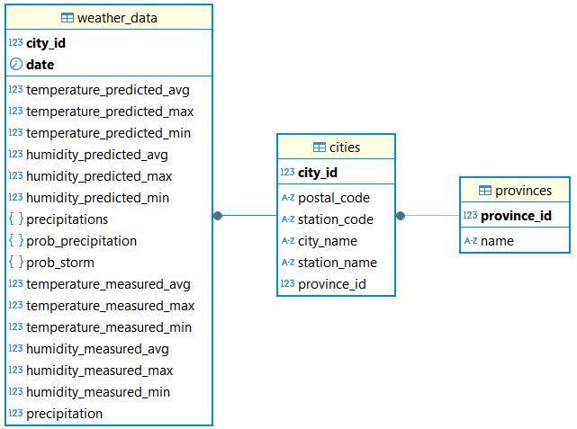

# Weather Data of Southeastern Spain

## 📖Introduction
This project is dedicated to monitoring meteorological data in the southeastern region of Spain, specifically in the provinces of Almeria, Murcia, Alicante, and Valencia, areas identified as at-risk for desertification and prone to DANA events. Leveraging data provided by the AEMET (Agencia Estatal de Meteorología) API, this project aims to gather, process, and analyze weather information crucial for understanding these environmental risks.

## 🌍Overview 

The application works by obtaining identifying values for each city stored in the database and making two queries to the AEMET API: one query returns the data collected and processed by the station of a certain city that are available days later, and the other query returns forecast data for the next 24 hours for the same city.

### Components

- `weather_cities.py`: script to obtain the weather data of all the cities to monitor that are stored in the database. It uses functions of `api\weather_api.py` and `database.py`.

- `api\weather_api.py`: file that contains the necessary functions for the queries to the AEMET API and the necessary processing of the data to store them in the database.

- `database\database.py`: file that has the database connection and disconnection functions, as well as data insertion functions on the API queries and obtaining data from the cities for the correct operation of `weather_cities.py`.

**Application Architecture**


### Data Storage

The application database, `southeast_spain_weather`, is composed of two tables:

- `cities`: table that stores the data about the cities and towns to be able to make the queries to the API as information for future data analysis.
- `weather_data`: table that stores the data of the API queries.



### API Queries
#### **Prediction data**
Hourly forecast for the city passed as a parameter: **postal_code**. Provides hourly information up to 48 hours.

Queries are performed starting from 20:00 to obtain values for the next 24 hours of the following day.

```sh
/api/prediccion/especifica/municipio/horaria/{postal_code}
```

There's another similar query:
```sh
/api/prediccion/especifica/municipio/diaria/{postal_code}
```
But it provides the same response data.

#### **Meteo data**
Returns a summary of weather values taken at a certain weather station on the specified date. In this case we have to put limits in the date so that they are 24 hours and coincide with the data of the prediction query.

```sh
/api/valores/climatologicos/diarios/datos/fechaini/{start_date}/fechafin/{end_date}/estacion/{station_code}
```

It' i's necessary to ask for data from 5-6 days before, since some stations may not have them ready until then.

## Selected cities and towns
We have select cities and towns with nearby meteorological stations and low accumulated precipitation percentages in recent years.

Areas with the highest risk of desertification and/or drought:

**Accumulated Precipitation in the Hydrological Year (2024)_**


**Spain-Aridity Index:**


**Cold Drop:**


## API AEMET
Web page with information for API queries: [AEMET OpenData](https://opendata.aemet.es/dist/index.html)

## ⚙️Installation and Configuration

### 1. Clone the repository

```sh
git clone https://github.com/Jesus-Guijarro/weather-spain.git
```
### 2. Create Virtual Environment and Install Dependencies

1. Create a virtual environment named `weather-env`:

```sh
cd weather-spain

python -m venv weather-env
```

2. Activate the virtual environment:

**🐧 Linux**:
```sh
source weather-env/bin/activate
```

**🖥️ Windows**:
```sh
weather-env\Scripts\activate
```

3. Install the required dependencies:
```sh
pip install -r requirements.txt
```

### 3. Setup Database 

Create the `southeast_spain_weather` database:

```sh
psql -U postgres
```

```sql
CREATE DATABASE southeast_spain_weather;
```
```sh
\c southeast_spain_weather;
```
Copy and run the content of `southeast_spain_weather_db.sql` in the terminal or database administration tool like DBeaver.


### 4. Config database file

1. Create the config database file:
```sh
touch config.ini
```

2. Configure your database connection details in `config.ini`:
```conf
[database]
dbname = southeast_spain_weather
user = username
password = ******
host = localhost
port = 5432
```

### 5. Create file folder and archive for logs`
Create `logs` folder and `weather_data_logs.log`file manually with the following commands:
```sh
mkdir logs

touch logs/weather_data_logs.log
```

### 6. Get API key from AEMET

To access AEMET's weather data, you need an API key. Follow these steps to obtain one:  

1. Go to the [AEMET OpenData website](https://opendata.aemet.es/centrodedescargas/altaUsuario).
2. Register for a free account by providing your email and filling out the required fields.
3. After registering, log in to your account.
4. Navigate to `Mis claves` section.
5. Generate a new API key and copy it for later use.

Once you have your API key, you can use it to authenticate your requests.

We create the `keys` folder and the file where to store the generated key:
```sh
mkdir keys

touch keys/api.txt
```

### 7. Final Project Structure

```
📦 weather-spain
├── 📂 api
│ └── 🐍 weather_api.py
├── 📂 database
│ ├── 🐍 database.py
│ └── 🛢️ southeast_spain_weather_db.sql
├── 📂 images
│ ├── 🖼️ accumulated-precipitation-2024.png
│ ├── 🖼️ application-architecture.png
│ ├── 🖼️ cold-drop.png
│ ├── 🖼️ entity-relationship-diagram.png
│ └── 🖼️ spain-aridity-index.png
├── 📂 keys
│ └── 📄 api.txt
├── 📂 logs
│ └── 📄 weather_data_logs.log
├── 📂 resources
│ ├── 🐍 get_all_stations.py
│ └── 📄 stations.txt
├── 📂 tests
│ ├── 📄 output_test.txt
│ └── 🐍 test_meteo.py
├── 📂 weather-env
├── 🚫 .gitignore
├── ⚙️ config.ini
├── 📜 LICENSE
├── 📄 README.md
├── 📄 requirements.txt
├── 🖥️ weather_cities.bat
├── 🐍 weather_cities.py
├── 🖥️ weather_city.bat
└── 🐍 weather_city.py
```

## 🚀Running the Project

### Manual Execution

1. Activate the virtual environment in the terminal from the main directory if it is not already activated:

```sh
source weather-env/bin/activate
```

2. We run the application with `python` or `python3` depending on the version of Python installed:
```sh
python weather_cities.py
```
3. In case there was no error in any of the cities and we have obtained the data from both queries, we can consult them in the database in the `weather_data` table. If we have had an error in any city we can use the `weather_city.py` script to try to get the data again.
```sh
python weather_city.py
```

### Automatic Execution
In this execution mode we are going to run `weather_cities.py` every day at 20:00 automatically.

#### 🐧 LINUX (cron job)
1. Open the terminal and edit the `crontab`:

```sh
crontab -e
```
2. Add the following line at the end of the file:
```sh
0 20 * * * /usr/bin/python3 /path/to/weather_cities.py
```
- Replace `/usr/bin/python3` with the correct Python path if needed.
- Replace `/path/to/weather_cities.py` with the actual script path.

#### 🖥️ WINDOWS (Task Scheduler)

1. Open **Task Scheduler** (Win + R, type taskschd.msc, and press Enter).
2. Click on **Create Basic Task**.
3. Name the task (e.g., Weather Data).
4. Select **Daily** and set the time to **20:00**.
5. In the **Action** step, choose **Start a Program**.
6. Browse and select weather_cities.bat.
7. Click **Finish** to save the task.

## 🔍Extra

- `resources\get_all_stations.py`: script to obtain information about available stations. Useful to update data that have changed and because of that you can't get data from some weather station.

- `weather_city.py`: file with which data from a specific city is obtained.

## 🛠Technologies Used

- Programming Language: Python
- Database: PostgreSQL
- Task Scheduler: cron /  Windows Task Scheduler

## 🔜Future improvements

- Develop the data visualization part.
- Process log information and implement changes in the project to reduce the number of daily errors produced when using the AEMET API.